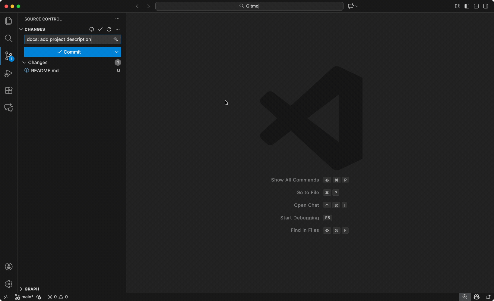
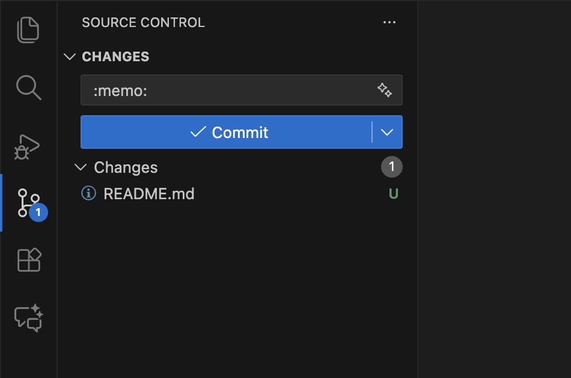

<p align="center">
    
</p>

<p align="center">
    <a href="https://github.com/carloscuesta/gitmoji">
        
    </a>
    <a href="https://github.com/seatonjiang/gitmoji-vscode/issues">
        
    </a>
    <a href="https://github.com/seatonjiang/gitmoji-vscode/pulls">
        
    </a>
    <a href="https://github.com/seatonjiang/gitmoji-vscode/blob/main/LICENSE">
        
    </a>
</p>

<p align="center">
    Extensão do VS Code para adicionar emojis às mensagens de commit
</p>

## 💻 Captura de tela

<p align="center">
    
</p>

## 📦 Instalação

1. Abra o [Visual Studio Code](https://code.visualstudio.com/).
2. Pressione `Ctrl+Shift+X` para abrir a aba "Extensões".
3. Digite `Gitmoji` para encontrar a extensão.
4. Clique em `Install` e, em seguida, em `Enable`.

## 🔨 Configuração

### Seleção do tipo de saída

- `outputType` - Configure o tipo de saída dos emojis conforme necessário. O padrão é `emoji`.

Exemplo para o tipo emoji:


Exemplo para o tipo code:



Exemplo de configuração:

```json
{
  "gitmoji.outputType": "emoji"
}
```

> **Observação**: Se você utiliza GitLab, recomenda-se o modo `code`. No GitHub, você pode usar `emoji` ou `code`.

### Adicionar emojis personalizados

- `addCustomEmoji` - Adiciona emojis personalizados além dos disponibilizados pelo Gitmoji.

Exemplo de configuração:

```json
{
  "gitmoji.addCustomEmoji": [
    {
      "emoji": "🧵",
      "code": ":thread:",
      "description": "Add or update code related to multithreading or concurrency"
    },
    {
      "emoji": "🦺",
      "code": ":safety_vest:",
      "description": "Add or update code related to validation"
    }
  ]
}
```

### Usar apenas seus emojis personalizados

- `onlyUseCustomEmoji` - Usa apenas os seus emojis personalizados, não os do Gitmoji.

Exemplo de configuração:

```json
{
  "gitmoji.onlyUseCustomEmoji": true
}
```

### Buscar Gitmoji por código de emoji

- `showEmojiCode` - Habilita a busca de Gitmoji pelo código do emoji (ex.: `ambulance` retorna `hotfix`).

Exemplo de configuração:

```json
{
  "gitmoji.showEmojiCode": true
}
```

### Posição de inserção

- `insertPosition` - Configura onde inserir o Gitmoji na mensagem de commit. O padrão é `start`.
- Valores possíveis:
- `start`: insere no início da mensagem e limpa emojis de prefixo existentes;
- `end`: insere no final da mensagem e limpa emojis de sufixo existentes;
- `cursor`: insere na posição atual do cursor no editor de mensagem de commit ou na caixa de entrada do SCM (priorizando o editor quando disponível).

Exemplo de configuração (inserir no cursor):

```json
{
  "gitmoji.insertPosition": "cursor"
}
```

Exemplo de configuração (inserir no final):

```json
{
  "gitmoji.insertPosition": "end"
}
```

### Correspondência automática baseada na mensagem de commit

- `autoMatch` - Habilita a correspondência automática de emojis com base na mensagem de commit.

Exemplo de configuração:

```json
{
  "gitmoji.autoMatch": true
}
```

### Permitir uso repetido de emojis

- `canRepeat` - Habilita o uso repetido de emojis na mensagem de commit.

Exemplo de configuração:

```json
{
  "gitmoji.canRepeat": true
}
```

## 💖 Apoie o projeto

Se este projeto foi útil para você, considere deixar uma estrela para mostrar seu apoio. Cada gesto ajuda a manter a motivação para otimizar e adicionar novos recursos!

## 🤝 Participe do desenvolvimento

Todas as contribuições são bem-vindas! Envie suas ideias como [Pull Requests](https://github.com/seatonjiang/gitmoji-vscode/pulls) ou [Issues](https://github.com/seatonjiang/gitmoji-vscode/issues).

## 📃 Licença de código aberto

Este projeto é distribuído sob a licença MIT. Para detalhes, consulte o arquivo [LICENSE](https://github.com/seatonjiang/gitmoji-vscode/blob/main/LICENSE).