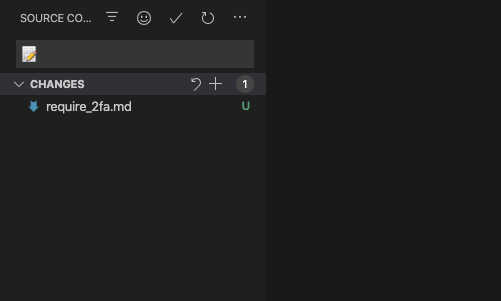
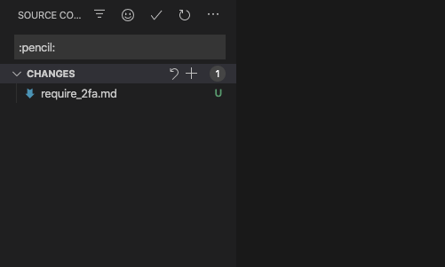

[English](README.md) | [简体中文](README.zh-CN.md) | [Português Brasileiro](README.pt-BR.md) | [Português Europeu](README.pt-PT.md) | [日本語](README.ja.md) | **Русский**

<p align="center">
    
</p>

<p align="center">
    <a href="https://github.com/carloscuesta/gitmoji">
        
    </a>
    <a href="https://github.com/seatonjiang/gitmoji-vscode/issues">
        
    </a>
    <a href="https://github.com/seatonjiang/gitmoji-vscode/pulls">
        
    </a>
    <a href="https://github.com/seatonjiang/gitmoji-vscode/blob/main/LICENSE">
        
    </a>
</p>

<p align="center">
    <a href="https://github.com/seatonjiang/gitmoji-vscode/issues">Sinalize o <i>bug</i></a>
    ·
    <a href="https://github.com/seatonjiang/gitmoji-vscode/issues">Solicite a nova função</a>
</p>

<p align="center">
    Gitmoji - плагин для commit с emoji в VSCode
</p>

## 💻 Скриншот

<p align="center">
    
</p>

## 📦 Установка

1. Установить [Visual Studio Code](https://code.visualstudio.com/).
2. Нажмите `Ctrl` + `Shift` + `X`, чтобы открыть руководство по расширениям.
3. Введите "Gitmoji", чтобы найти расширение.
4. Нажмите кнопку `Установить`, затем кнопку `Активировать`.

## 🔨 Конфигурация

### Выберите тип вывода

- `outputType` - При необходимости настройте тип вывода эмодзи. По умолчанию используется `эмодзи`.

Для типа эмодзи:



Для типа кода:



Sample configuration:

```json
{
  "gitmoji.outputType": "emoji"
}
```

> **Notice**: Если вы используете Gitlab, введите emoji, если вы используете GitHub, вы можете ввести код или emoji.

### Добавляйте настраиваемые дополнительные эмодзи

- `addCustomEmoji` - Добавьте пользовательские эмодзи, отличные от Gitmoji.

Sample configuration:

```json
{
  "gitmoji.addCustomEmoji": [
    {
      "emoji": "🧵",
      "code": ":thread:",
      "description": "Добавление или обновление кода, связанного с многопоточностью или параллелизмом"
    },
    {
      "emoji": "🦺",
      "code": ":safety_vest:",
      "description": "Добавьте или обновите код, связанный с проверкой"
    }
  ]
}
```

### Используйте только свои собственные эмодзи

- `onlyUseCustomEmoji` - Используйте только свои собственные эмодзи, а не те, что есть в Gitmoji.

Пример конфигурации:

```json
{
  "gitmoji.onlyUseCustomEmoji": true
}
```

### Поиск Gifmoji по коду эмодзи

- `showEmojiCode` - Включите поиск gitmojis по коду эмодзи (пример: скорая помощь вернет исправление).

Пример конфигурации:

```json
{
  "gitmoji.showEmojiCode": true
}
```

## 🤝 Сообщество

Мы приветствуем любой вклад. Вы можете отправлять любые идеи в виде запросов на получение информации или в виде вопросов, желаю хорошо провести время! :)

## 📃 Лицензия

Проект выпущен под лицензией MIT, подробности смотрите в файле [LICENCE](https://github.com/seatonjiang/gitmoji-vscode/blob/main/LICENSE).